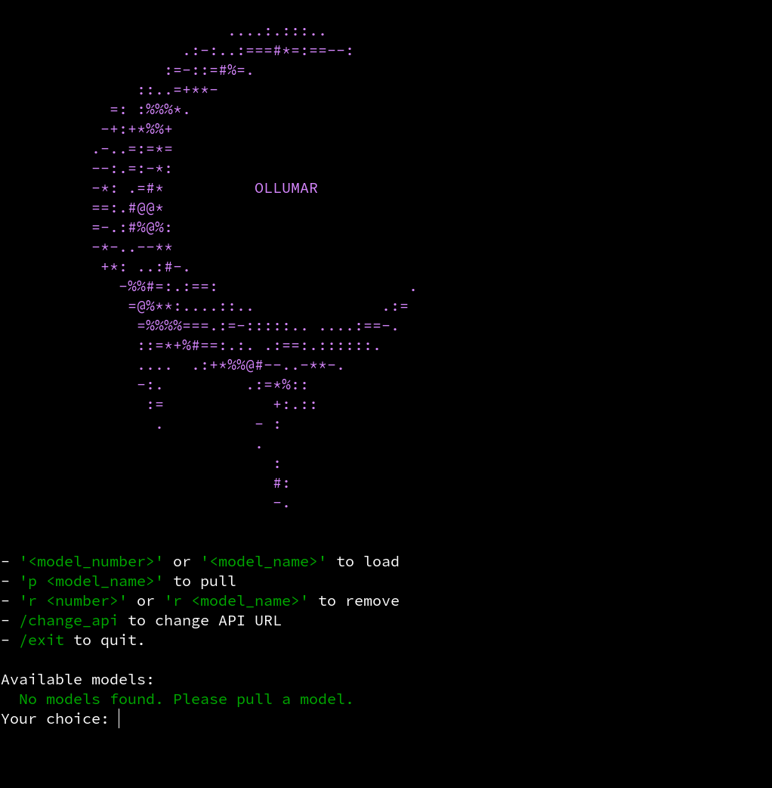

# Ollumar 🤖💬

Ollumar is a powerful, terminal-based chat application that connects you with AI models through the Ollama backend. With an intuitive interface and rich feature set, it's designed to enhance your AI interactions in a lightweight, efficient package.

## ✨ Features

- **Multiple Models** - Seamlessly switch between any AI model
- **Internet Search** - Enhance your AI's knowledge with built-in DuckDuckGo search integration
- **Thinking Indicators** - Visual feedback when the AI is processing complex queries
- **Deep Research Mode** - Get comprehensive answers through multi-step research iterations
- **Command System** - Intuitive slash commands with smart auto-completion
- **Chat History** - Continue where you left off
- **Customizable Parameters** - Fine-tune your experience by adjusting temperature, top_p, top_k, and more
- **Rich Terminal Interface** - Enjoy a colorful, interactive experience in your terminal

## 🚀 Installation

### Prerequisites

- Python 3.6 or higher
- [Ollama](https://ollama.com) installed and running

### Quick Install

```bash
git clone https://github.com/EnkryptattuDev/ollumar.git && cd ollumar && chmod +x install.sh && ./install.sh
```

### Manual Installation

1. Clone the repository:
```bash
git clone https://github.com/EnkryptattuDev/ollumar.git
cd ollumar
```

2. Run the installer:
```bash
bash install.sh
```

3. Follow the prompts to complete your setup!

## 🎮 Using Ollumar

After installation, launching Ollumar is simple:

```bash
ollumar
```

Or if you opted out of creating a terminal command:

```bash
~/ollumar/launch.sh
```

## 🧠 How Ollumar Works

### Model Selection Interface

When you first launch Ollumar, you'll be greeted with the model selection menu:



This is where you choose which AI model to chat with. The menu shows all models available on your Ollama installation and gives you several options:

- **Select a model** - Enter the number or name of any listed model to start chatting with it
- **Pull new models** - Type `p modelname` to download a new model
- **Remove models** - Use `r modelname` or `r number` to delete models you no longer need
- **Change API connection** - Connect to a different Ollama instance with `/change_api`
- **Exit** - Close the application with `/exit`

### Chat Interface

After selecting a model, you'll enter the main chat interface:


In the chat interface, you'll see features like slash commands for accessing different functions, visual thinking indicators when the AI is processing complex queries, and search results when the AI looks up information online.

### How Searches Work

Ollumar can search the internet to give you up-to-date information. This works in two ways:

#### Auto Search
When auto search is enabled:
1. You ask a question that might benefit from recent information
2. AI automatically generates a good search query
3. It searches the web and finds relevant information
4. The AI uses this information when giving you an answer

#### Manual Search
In manual mode:
1. Include `search "your question"` in your message
2. AI will search for exactly what you put in quotes
3. The AI will use those search results when answering you

You can toggle between these modes with the `/toggle_search_mode` command.

### Deep Research Mode

This feature turns Ollumar into a thorough research assistant:

1. **Ask a complex question** - Enable deep research with `/toggle_deep_research` and ask your question
2. **Clarify your needs** - AI will ask you some follow-up questions to understand exactly what you're looking for
3. **Watch it work** - AI will:
   - Break your question down into several aspects to research
   - Search the internet for information on each aspect
   - Analyze the results as it goes
4. **Get a complete answer** - After researching, AI will provide a comprehensive, well-organized response

### Saving and Accessing Chat History

Ollumar automatically saves your conversations (unless turned off). You can:
- View past conversations with the `/history` command
- Continue previous chats by selecting them from the history menu
- Delete individual or all chat records from the same menu

## 🛠️ Command Reference

- `/help` - See all available commands
- `/settings` - Check your current configuration
- `/reset` - Start fresh with default settings
- `/change_model` - Switch to a different AI model
- `/history` - Browse and reload past conversations
- `/clear` - Start a fresh conversation
- `/exit` - Close the application
- `/toggle_history` - Turn chat saving on/off
- `/toggle_search` - Enable/disable internet lookups
- `/toggle_search_mode` - Switch between automatic and manual searching
- `/search_count <number>` - Control the number of search results
- `/search_amount <number>` - Adjust amount of text per search result
- `/context_size <number>` - Change how much conversation the AI remembers
- `/toggle_deep_research` - Activate in-depth research mode
- `/deep_research_amount <number>` - Set research thoroughness
- `/set_system_prompt <text>` - Customize the AI's instructions
- `/set_top_p <number>` - Fine-tune sampling diversity (0.0-1.0)
- `/set_top_k <number>` - Adjust token selection pool size
- `/set_temperature <number>` - Control creativity vs. consistency (0.0-2.0)

## 🧹 Uninstalling

If you ever need to uninstall Ollumar:

```bash
bash install.sh
```

Then select the uninstall option from the menu.

## 📜 License

This project is licensed under the MIT License - see the [LICENSE](LICENSE) file for details.

## 👏 Acknowledgments

- [Ollama](https://github.com/ollama/ollama) - The backend that powers Ollumar
- [Rich](https://github.com/Textualize/rich) - Terminal formatting
- [prompt_toolkit](https://github.com/prompt-toolkit/python-prompt-toolkit) - Interactive command interface
- [DuckDuckGo Search](https://github.com/deedy5/duckduckgo_search) - Web search capabilities
- [Beautiful Soup](https://www.crummy.com/software/BeautifulSoup/) - HTML parsing for search results
- [Requests](https://requests.readthedocs.io/) - HTTP library for API interactions
---